**❗️项目声明：本项目为开源的数字商品商城系统，仅供学习、研究与合法业务使用。请遵守所在地法律法规及支付服务商规则；项目作者及贡献者不对使用本项目开展的第三方交易、内容或服务承担责任。遇到问题请通过 GitHub 提交 `issue`，请勿将开源项目用于违法违规用途。**

---

# Cloudflare 自动发卡 卡密权益商城

<p align="center">
  基于 Cloudflare Workers 的轻量级数字商品商城与管理后台
</p>

<p align="center">
  <a href="https://github.com/cloudwebsite/Cloudflare_faka/blob/main/LICENSE">
    
  </a>
  <a href="https://github.com/cloudwebsite/Cloudflare_faka/stargazers">
    
  </a>
</p>

## 介绍

Cloudflare 自动发卡商城 运行在 **Cloudflare Workers** 上，提供商品展示、下单支付、自动发卡、人工/实物发货、会员账户、内容运营、消息推送与运营后台。数据保存在 Cloudflare D1，适合个人商店或轻量发卡站。

[在线预览](https://faka.18178.site/) · [一键部署](#一键部署到-cloudflare-workers)

## 页面展示

> 前台商城


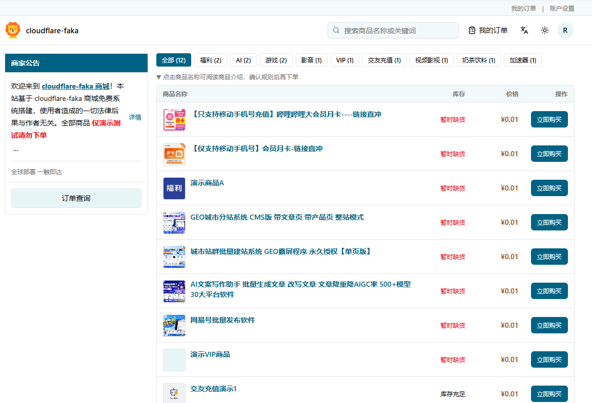
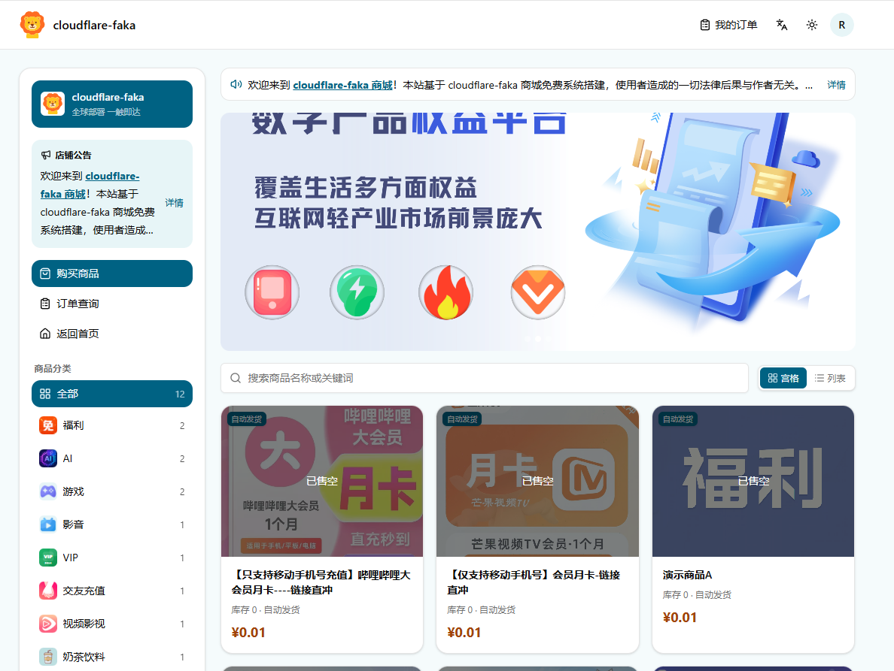

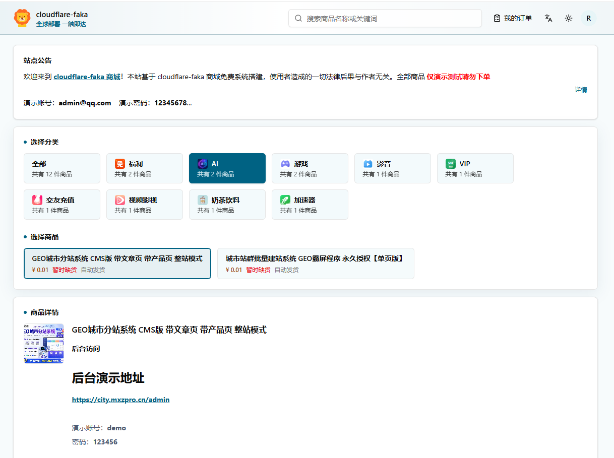


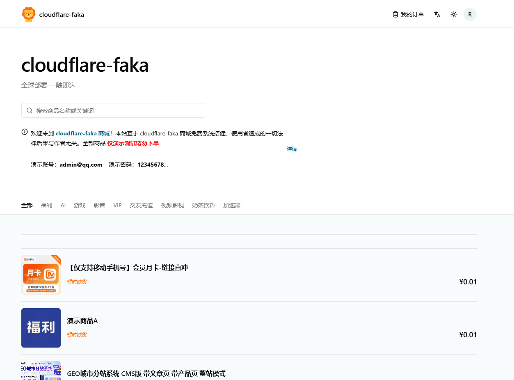
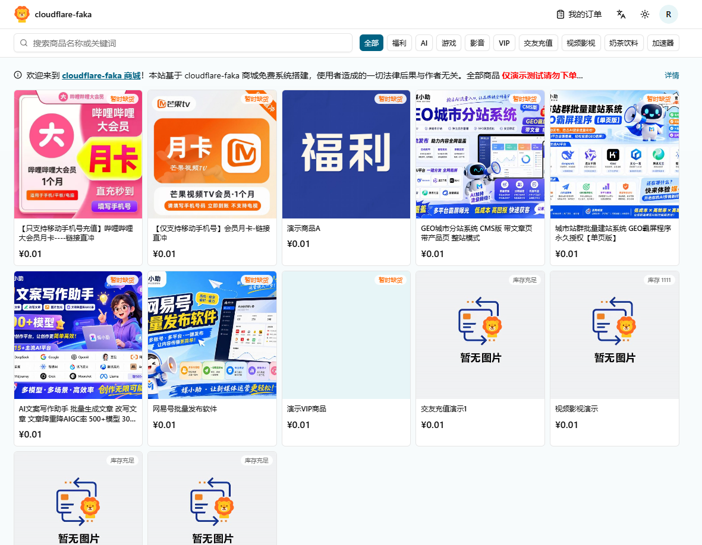


> 后台管理

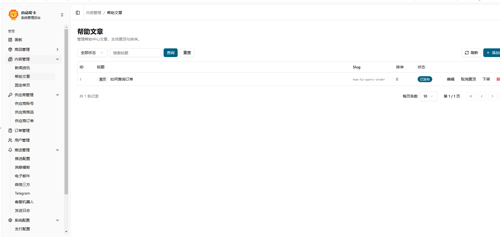

## 核心特性

- **边缘部署**：Workers 一键上线，GitHub Actions 同步更新
- **商品体系**：分类、上下架、富文本详情、封面图、限购、优惠券、首页轮播
- **上游供应商**：独角 Next、ACG（含多协议版本）导入绑定，库存/成本同步与自动履约
- **多种交付**：卡密自动发货、固定内容、人工发货、实物快递、供应商代发
- **支付渠道**：支付宝、易支付、BEpusdt、Stripe、HashPay、PerPay、PayPal
- **订单保障**：回调校验、支付日志、超时关单并释放库存/优惠券
- **会员与访客**：注册登录（可关闭注册）、双因素认证、订单查询与访客订单找回
- **内容运营**：新闻资讯、帮助中心、固定单页（协议/关于等），页脚与导航可联动展示
- **前台模板**：9 套布局 × 9 套配色皮肤，后台即时切换；支持白天/黑暗主题
- **多语言**：前台简体中文 / 繁体中文 / English，浏览器语言自动识别并可手动切换
- **站点配置**：时区、公告、客服、SEO 副标题、Logo/Favicon、页头/页脚自定义代码
- **消息通知**：邮件、Telegram、企业微信；模板、测试、重试与发送日志
- **Telegram 客服**：Webhook 查单、人工转发，与通知 Bot 独立配置
- **媒体库**：S3 兼容存储，图片/PDF 上传、站内代理与缓存；推荐 [Backblaze B2](https://www.backblaze.com/)（免费 10GB，免绑卡/手机号），已适配 Cloudflare 小黄云，接入后流量费全免；未走 CF 时可改用其他 S3 或图床
- **安全后台**：随机管理路径、首位管理员初始化、敏感配置脱敏、Turnstile 可选

## 后台模块一览

| 模块 | 能力 |
| --- | --- |
| 运营面板 | 订单与经营汇总 |
| 商品管理 | 分类、商品、卡密库存、优惠券 |
| 内容管理 | 新闻、帮助文章、固定单页 |
| 订单 / 用户 | 履约处理、关单、用户与 2FA 状态 |
| 供应商 | 账号、上游商品绑定、采购订单与重试 |
| 推送管理 | 事件策略、邮件通道、企微、Telegram 通知与客服机器人、发送日志 |
| 系统配置 | 支付、媒体、站点与模板、轮播、安全、定时任务异常 |

## 前台模板

在 **系统配置 → 站点配置** 中选择布局与皮肤：

| 布局 | 说明 |
| --- | --- |
| 经典商城 | 顶栏 + 公告搜索 + 分类芯片 + 四列卡片 |
| 集市密集 | 紧凑顶栏、吸顶分类、密集商品卡 |
| 杂志 Hero | 大图 Hero + 精选大卡 + 列表式商品 |
| 侧栏目录 | 左侧分类栏 + 右侧商品网格 |
| 分区商城 | 分类轨 + Banner + 分类墙，列表/宫格可切换 |
| 快卡选购 | 单页完成分类 → 选品 → 介绍 → 下单 |
| 展柜商城 | 蓝顶栏 + Banner + 图标分类 + 筛选宫格 |
| 卡片列表 | 白顶栏侧栏导航 + 封面商品卡 |
| 批发目录 | 商家公告 + 密集商品表，点击展开介绍 |

皮肤：默认、海洋、燃橙、岩灰、松绿、蔷薇、晴空、琥珀、葡萄。

## 一键部署到 Cloudflare Workers

[](https://deploy.workers.cloudflare.com/?url=https://github.com/cloudwebsite/Cloudflare_faka)

[查看部署图文教程](./docs/imgs/wiki/deploy.jpg)

点击按钮后按提示创建 D1，并配置：

| 变量 | 类型 | 说明 |
| --- | --- | --- |
| `ADMIN_PATH` | 普通变量 | 后台路径，使用难猜的随机字符串，**不含** `/`，例如 `admin-3q9527ko8` |
| `BETTER_AUTH_SECRET` | Secret | 会话签名密钥，可用 `openssl rand -base64 32` 生成 |
| `TURNSTILE_SITE_KEY` | 可选 | Turnstile 站点密钥；启用验证码时需同时配置 Secret |
| `TURNSTILE_SECRET_KEY` | 可选 Secret | Turnstile 密钥；启用验证码时需同时配置站点密钥 |

部署完成后：

1. 打开 `https://你的Workers域名/setup`，创建首位 root 管理员（完成后不可再创建）。
2. 访问 `https://你的Workers域名/${ADMIN_PATH}` 登录后台。
3. 在 **系统配置 → 站点配置** 填写站点名称、公开地址、时区、公告、客服与页脚；选择前台布局/皮肤。
4. 配置支付渠道、创建商品，并导入卡密或设置发货方式；按需配置内容、轮播与推送。
5. 在 **系统配置 → 媒体存储** 填入 S3 兼容端点。推荐 [Backblaze B2](https://www.backblaze.com/)：免费 10GB、免绑卡与手机号验证；本项目已适配 Cloudflare（小黄云），接入后出站流量费全免。未接入 Cloudflare 时请改用其他 S3 或图床。

> 一键部署时请保持 `wrangler.jsonc` 中 D1 的 `database_id` 为注释状态，由 Cloudflare 部署流程创建并绑定。

### 更新版本

一键部署会在你的 GitHub 下创建独立仓库，可用 Actions 从上游同步最新代码。

> [!IMPORTANT]
> 一键部署生成的仓库**不会自动带上** GitHub Actions。请在你的仓库中手动创建 `.github/workflows/update-faka.yml`，复制本仓库的 [更新工作流](https://github.com/cloudwebsite/Cloudflare_faka/blob/main/.github/workflows/update-faka.yml) 后提交。

1. 打开你的仓库 → **Actions** → **Update CFFK** → **Run workflow**。
2. 工作流会拉取 `cloudwebsite/Cloudflare_faka` 的 `main` 并推送到你的仓库；若已绑定 Cloudflare Git，将自动重新部署。

[查看 Actions 更新图文教程](./docs/imgs/wiki/actions1.jpg)

同步会保留当前仓库的 `wrangler.jsonc`（避免覆盖 D1 绑定），其余未合并的本地改动可能被覆盖。有二次开发时请先备份，或通过分支 / PR 合并。

## 本地开发

环境：Node.js 20+、bun、Wrangler（本地 D1）。

```bash
bun i                # 安装依赖
bun db:generate      # 修改 schema.ts 后生成迁移；已有初始迁移时可跳过
bun db:migrate:local # 应用本地 D1 迁移
bun db:seed:local    # 导入默认数据
bun dev              # 启动 → http://localhost:3000
```

本地变量写入未提交的 `.dev.vars`：

```ini
ADMIN_PATH=admin
BETTER_AUTH_SECRET=local-development-secret
# TURNSTILE_SITE_KEY=your-site-key
# TURNSTILE_SECRET_KEY=your-secret-key
```

```bash
bun run lint              # ESLint
bun run test              # 核心单测
bun run db:check          # 检查 migration
bun run build             # 构建（勿在 CI 中跑 db:generate，以免覆盖迁移）
bun run db:migrate:remote # 应用远程 D1 migration
bun run deploy            # 迁移、种子数据并部署
bun run up                # 迁移、构建并部署（不含 seed）
```

更多文档：[Workers](https://developers.cloudflare.com/workers/) · [D1](https://developers.cloudflare.com/d1/)

## 功能截图

| 商城首页 | 商品详情 | 订单查询 |
| --- | --- | --- |
| <a href="./docs/imgs/shop.jpg" target="_blank"></a> | <a href="./docs/imgs/shop1.jpg" target="_blank"></a> | <a href="./docs/imgs/order.jpg" target="_blank">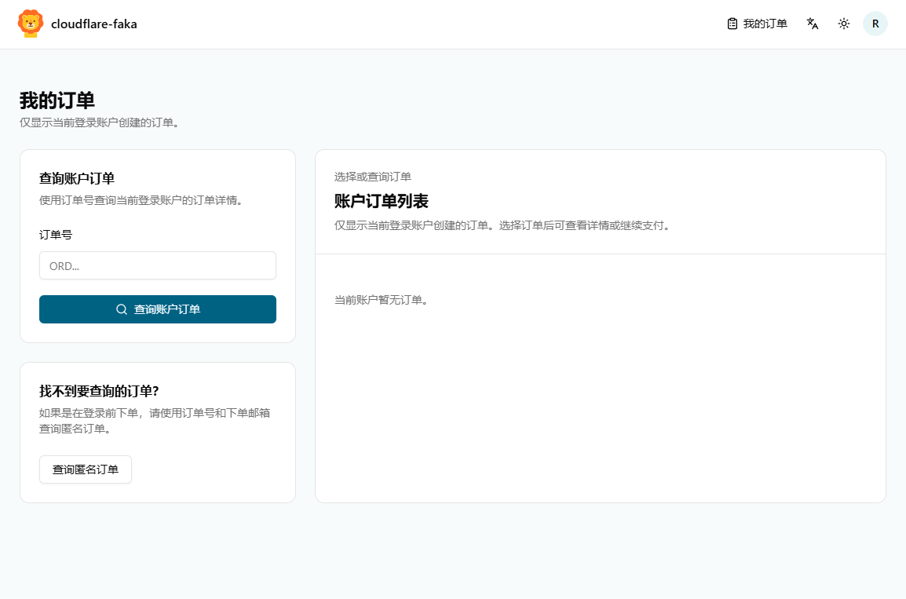</a> |

| 创建商品 | 支付配置 | 站点配置 |
| --- | --- | --- |
| <a href="./docs/imgs/product.jpg" target="_blank">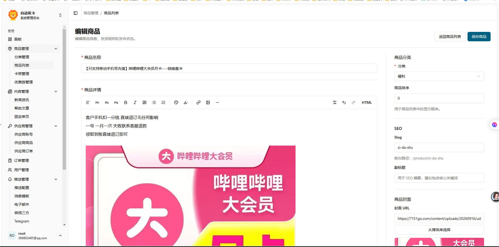</a> | <a href="./docs/imgs/pay.jpg" target="_blank">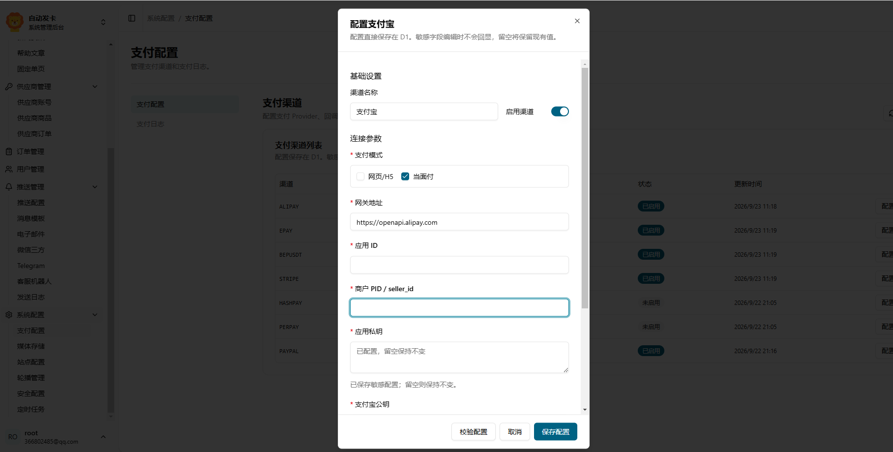</a> | <a href="./docs/imgs/settings.jpg" target="_blank">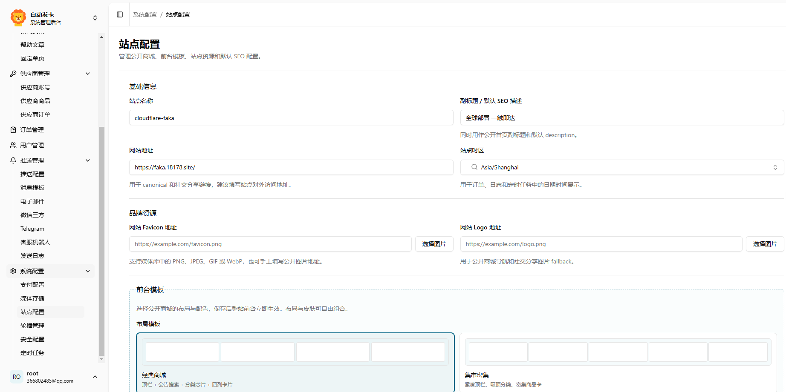</a> |

| 消息推送 | 媒体存储 | 安全配置 |
| --- | --- | --- |
| <a href="./docs/imgs/push.jpg" target="_blank">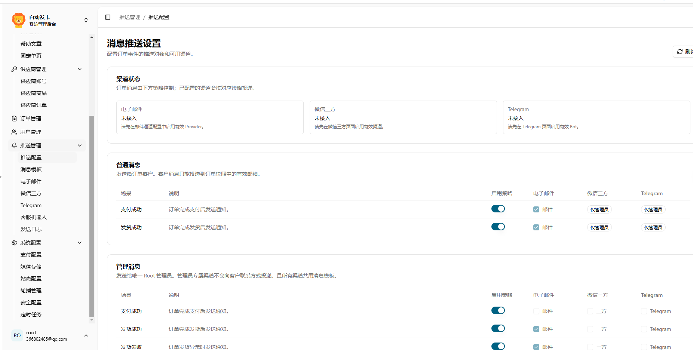</a> | <a href="./docs/imgs/media.jpg" target="_blank">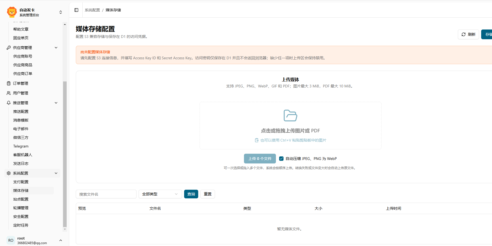</a> | <a href="./docs/imgs/security.jpg" target="_blank">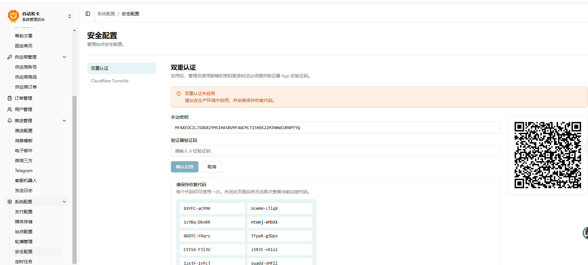</a> |

## 技术栈

- **前端**：Vike、Vue 3、Vite、Tailwind CSS、shadcn-vue / Reka UI、TipTap
- **服务端**：Hono + Telefunc + Cloudflare Workers
- **数据库**：Cloudflare D1 + Drizzle ORM
- **认证**：Better Auth（邮箱密码、双因素）
- **部署**：Wrangler、Cloudflare Cron Trigger
- **存储**：S3 兼容对象存储（推荐 [Backblaze B2](https://www.backblaze.com/)，配合 Cloudflare 可免流量费）

## 常见问题

- **后台打不开**：确认路径为 `/${ADMIN_PATH}`，并核对部署变量是否填对。
- **没有管理员**：访问 `/setup` 创建首位管理员（仅未初始化时可用）。
- **支付回调失败**：在站点配置中填写正确的公开站点地址，并核对支付渠道回调 URL 与密钥。
- **邮件未发送**：在推送管理中启用并测试邮件通道，再检查推送策略与模板。
- **媒体上传失败**：配置 S3 端点 / Bucket / 凭据后，用「测试连接」验证读写删权限。推荐 [Backblaze B2](https://www.backblaze.com/)（免费 10GB，免绑卡/手机号）；经 Cloudflare 小黄云接入后流量费全免，未接入 CF 请选用其他 S3 或图床。
- **前台样式没变**：在站点配置中切换布局/皮肤并保存后刷新前台；确认已应用含模板字段的数据库迁移。
- **内容页 404**：在 **内容管理** 发布新闻/帮助/单页，并确认 slug 与前台路径一致（`/news`、`/help`、`/page/:slug`）。
- **Telegram 客服无响应**：在推送管理 → 客服机器人中配置 Bot Token、Webhook Secret 与管理员 Chat ID，并完成 Webhook 注册。

### 忘记管理员密码？

本系统使用 Better Auth：登录标识是 **邮箱**（`/setup` 时填写），密码存在 `account` 表，算法为 scrypt（`salt:key`）。

若已配置邮件通道，可在登录页走「忘记密码」邮件重置。否则在 Cloudflare D1 控制台执行下方 SQL，将首位管理员密码临时重置为 `admin123456`（[如何执行 SQL](#如何执行-sql)）：

```sql
-- 查看 root 管理员邮箱（登录时用这个邮箱）
SELECT u.id, u.email
FROM "user" u
JOIN adminBootstrap a ON a.userId = u.id
WHERE a.id = 1;

UPDATE account
SET password = 'ee1fc357e8931e5e157832073ba69514:a3093e2308b46a7ef0c51724dbe1fcf6483a8ce9350583355f5dc6d93f68a5d2e187213378e575ad7fb9f1757166a080775580601bbd2e2f15b3142fb4a899db',
    updatedAt = CAST(unixepoch() * 1000 AS INTEGER)
WHERE providerId = 'credential'
  AND userId = (SELECT userId FROM adminBootstrap WHERE id = 1);

DELETE FROM session
WHERE userId = (SELECT userId FROM adminBootstrap WHERE id = 1);
```

用查出的邮箱 + `admin123456` 登录后台，立即前往 **账户设置** 修改密码。

### 忘记双重认证验证码？

双重认证状态在 `user.twoFactorEnabled`，密钥在 `twoFactor` 表。

验证器丢失时，可在 D1 控制台临时关闭首位管理员的双重认证（[如何执行 SQL](#如何执行-sql)）：

```sql
UPDATE "user"
SET twoFactorEnabled = 0,
    updatedAt = CAST(unixepoch() * 1000 AS INTEGER)
WHERE id = (SELECT userId FROM adminBootstrap WHERE id = 1);

DELETE FROM twoFactor
WHERE userId = (SELECT userId FROM adminBootstrap WHERE id = 1);

DELETE FROM session
WHERE userId = (SELECT userId FROM adminBootstrap WHERE id = 1);
```

关闭后请立即登录后台，前往 **系统配置 → 安全配置** 重新绑定验证器 App。该操作需要数据库管理权限，仅作为账号恢复手段。

### 如何执行 SQL

1. 进入 [dash.cloudflare.com](https://dash.cloudflare.com) → **存储和数据库** → **D1 数据库**
2. 打开你的数据库（名称以部署时创建的为准）
3. 顶部标签 → **控制台**，粘贴 SQL 后执行

## 致谢

感谢以下开源项目：

- [BEpusdt](https://github.com/v03413/BEpusdt) — 加密货币收款
- [HashPay](https://github.com/TGDash/HashPay) — Workers 上的加密货币收款网关
- [PerPay](https://github.com/Mashiro0619/PerPay) — 免挂机监听、免商户签约的个人支付系统
- [worker-mailer](https://github.com/zou-yu/worker-mailer) — Workers 环境 SMTP
- [Cloudflare Workers](https://workers.cloudflare.com/) — 边缘计算平台

## 反馈与支持

- 问题与建议：[GitHub Issues](https://github.com/cloudwebsite/Cloudflare_faka/issues)
- 仓库地址：https://github.com/cloudwebsite/Cloudflare_faka
